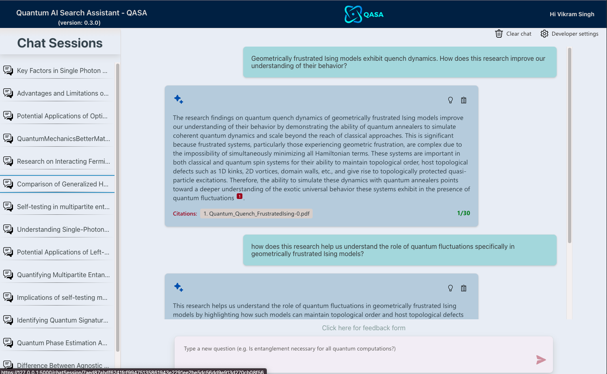
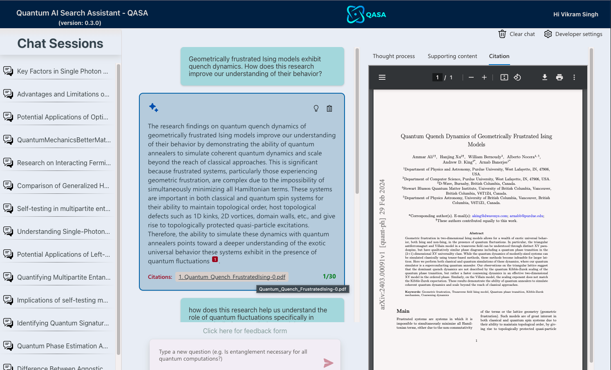
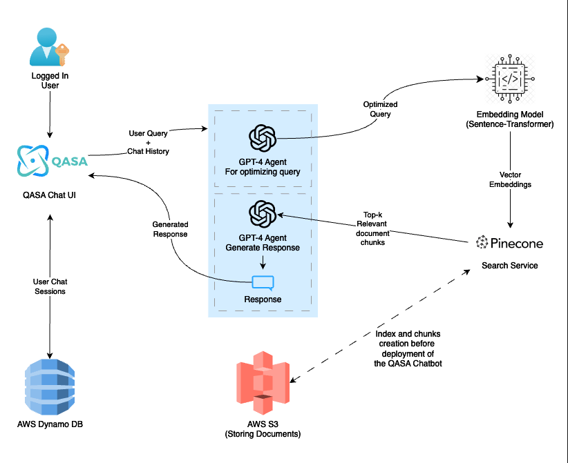

# AI-DocExplorer: AI-Enhanced Plug-and-Play RAG Document Explorer

AI-DocExplorer is a flexible AI-powered chatbot framework designed to streamline the search, discovery and interaction process within extensive document databases. By harnessing cutting-edge AI technologies, it offers a dynamic chat interface enabling users to delve into any subject matter with ease. The framework is uniquely crafted to understand queries contextually, drawing on a diverse range of insights gleaned from a comprehensive document corpus. We have demonstrated its adaptability using an example implementation on Quantum physics research document corpus.


## Customizable and Service-Agnostic Architecture

Designed with flexibility at its core, AI-DocExplorer can be easily tailored for various domains beyond quantum physics. It is engineered to be service-agnostic, allowing seamless integration with alternative or additional services for document storage, search, or AI model processing. Users can extend or replace the default services by simply adding new service adapters in the `backend/services` directory, adapting the framework to meet specific project requirements or to tap into other powerful AI functionalities and data sources.

## Example Implementation: Quantum AI Search Assistant (QASA)

As a demonstration of its adaptability, AI-DocExplorer is exemplified through the Quantum AI Search Assistant (QASA). This specialized implementation is adeptly configured for navigating the intricate landscape of quantum physics research. QASA exemplifies the framework's potential, empowering users to streamline their queries, retrieve pertinent sections from scholarly articles, and synthesize information into well-informed, nuanced responses.



*QASA in action: An interactive chat session with the AI providing insights on quantum physics.*


*QASA in action: Accessing the citation documents stored on `AWS S3` right in the app view.*

## Architecture Overview

The architecture of AI-DocExplorer (illustrated in QASA's context) is built on several scalable and powerful cloud services, ensuring a seamless and dynamic user experience.


*Behind-the-scenes of AI-DocExplorer: A diagram showing the interplay of services.*

### Services and Workflow:

1. **Storage Service (AWS S3)**: Hosts a bucket where documents are securely stored.
2. **Search Service (Pinecone)**: Maintains a vector index for each document chunk, allowing for efficient retrieval.
3. **LLM Service (OpenAI GPT-4)**: Enhances user queries, generates responses, and crafts session names.
4. **LLM Embedding Model (Sentence-Transformers)**: Transforms queries into vector embeddings, aiding in the search process.
5. **Chat Storage Service (AWS DynamoDB)**: Archives current and historical chat sessions for user reference.

## Features

- **Interactive Chat**: Engage with the AI in a natural conversation flow.
- **Document-Driven Insights**: Receive answers that cite sections from the loaded documents.
- **Dynamic Search**: The AI dynamically fetches relevant document sections based on your query.
- **Session Continuity**: Return to past conversations or start new ones, all stored in a scalable database.

# Getting Started

To adapt AI-DocExplorer for your application, follow these steps:

1. Clone the repository: `git clone https://github.com/your-username/AI-DocExplorer.git`
2. Creat an AWS s3 bucket to store the documents and a Pinecone index.
3. Customize the AI prompts in the `approaches/chatreadretrieveread.py` to fit your domain.
4. Set up AWS DynamoDB table according to your session management needs.
5. Copy the documents into the `data/` folder.
6. Change the directory to `DataPreprocessing/` folder in your terminal.
7. Run the file `prepare_documents.py` with additional input variables as shown below. It will create chunks from the documents and store them in your pinecone index. 

```bash
python prepare_documents.py "data/*" --pineconekey "<your pinecone service api key>" --index "<index name on search service>" --s3accesskey "<your s3 access key>" --s3secretkey "<your s3 secret access key>" --bucketname "<your bucket name on s3>" -v
```


Detailed setup and installation instructions can be found in the documentation below.

## Installation

This section provides detailed steps to set up and run AI-DocExplorer locally, and guidelines for deploying it to a web service like Azure Web App or Amazon Elastic Beanstalk.

### Local Setup

#### Backend Dependencies

```bash
# creating python virtual environment for the backend
python -m venv backend/backend_env

# For windows
cd backend
./backend_env/Scripts/python.exe -m pip install -r requirements.txt

# For Mac OS
cd backend
source ./backend_env/bin/activate
pip install -r requirements.txt
```

#### Frontend Dependencies
```bash
cd frontend
# if the packages are not installed then run the command below
npm install
```
```
npm run build
cd ..\backend 
```


#### Environment Variables Setup

Ensure you have the necessary environment variables set up by creating a `.env` file in `.environments/<your-env-name>` and updating the content with your service credentials.

```plaintext
# Update with your API keys and service details
# Openai API key
LLM_SERVICE_NAME="<your LLM service Name or openai>"
LLM_API_KEY="<Your LLM service api key>"

# Embedding LLM service and model name
LLM_EMBED_SERVICE_NAME="<LLM Embedding model service name>"
LLM_EMBED_MODEL_NAME="<LLM Embedding model name>"

# Pinecone key
SEARCH_SERVICE_NAME = "<Search Service name, e.g. pinecone>"
SEARCH_API_KEY="<Search Service API key>"
SEARCH_INDEX_NAME="<Search Index name>"
KB_FIELDS_SOURCEPAGE="<Sourcepage field name on Index>"
KB_FIELDS_CONTENT="<Text content field name on Index>"

#S3 access key
DOC_STORAGE_SERVICE_NAME="<Storage Service name for storing documents>"
DOC_STORAGE_SECRET_ACCESS_KEY="<Storage Service secret access key>"
DOC_STORAGE_ACCESS_KEY_ID="<Storage Service access key>"
DOC_STORAGE_BUCKET_NAME="<Storage service bucket/container name>"

CHAT_STORAGE_SERVICE_NAME="<Storage service name for storing chat sessions>"
CHAT_STORAGE_SECRET_ACCESS_KEY="<Chat storage service secret access key>"
CHAT_STORAGE_ACCESS_KEY_ID="<Chat storage service access key>"
CHAT_STORAGE_TABLE_NAME="<Chat storage table name>"
CHAT_STORAGE_REGION_NAME="<Chat storage service region name>"

FLASK_SECRET_KEY="<Define you secret flask key>"
```

Make sure to update the path to this `.env` file in `backend/app.py` with your environment name in the `load_dotenv()` function call.

#### Run Locally
Activate the virtual environment and start the app.
```bash
# For Windows
./backend_env/Scripts/python.exe ./app.py

# For Mac OS/Linux
source backend_env/bin/activate
python app.py
```

### Deploy to cloud using Azure Web App or Amazon Elastic Beanstalk
#### Build the Frontend
```bash
cd frontend
npm install
npm run build
cd ../backend
```

#### Deploy Backend
Include the following files and folders from the backend directory when deploying to your web app:
```plaintext
- approaches/
- services/
- static/
- app.py
- langchainadapter.py
- lookuptool.py
- requirements.txt
- text.py
- version.json
```

Follow the deployment guidelines specific to Azure Web App or Amazon Elastic Beanstalk for setting up environment variables and deploying your application.

## License
This project is open-sourced under the [Apache-2.0 license](https://github.com/vspvikram/Plug-and-Play-RAG/tree/main?tab=Apache-2.0-1-ov-file#readme)

## Acknowledgements

AI-DocExplorer is based on a foundational template provided by [Azure](https://github.com/Azure-Samples/azure-search-openai-demo/tree/vectors). We have adapted and expanded upon this template to develop a versatile framework that caters to a wide range of document exploration needs. Special thanks to the Azure team for providing the building blocks that have facilitated the development of AI-DocExplorer.

